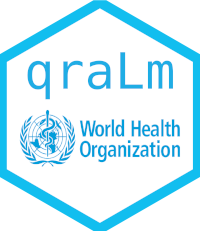

<!-- README.md is generated from README.Rmd. Please edit that file -->

```{r, include = FALSE}
knitr::opts_chunk$set(
  collapse = TRUE,
  comment = "#>",
  fig.path = "man/figures/",
  out.width="100%"
)
```

# qraLm <a href='https://github.com/WorldHealthOrganization/qraLm/docs/'></a>

The qraLm R package is designed for conducting Quantitative Risk Assessments (QRA) for *Listeria monocytogenes* in various food products. These include frozen vegetables, ready-to-eat (RTE) diced cantaloupe, and cold-smoked fish. The package was developed as part of the [Joint FAO/WHO Expert Meetings on Microbiological Risk Assessment (JEMRA)](https://www.who.int/publications/m/item/jemra-of-listeria-monocytogenes-in-foods).


## Key Features

- Dose-Response Models: The package includes models to assess the risk based on different strain virulence and population susceptibility (age, health conditions).

- Monte Carlo Simulations: It supports simulations to estimate risks at various stages of the food production chain, from processing to consumer handling practices.

- Specific Food Pathways: Different modules represent distinct pathways for contamination and risk for each food type, such as blanching, packaging, and defrosting in frozen vegetables, or cross-contamination and processing stages in cold-smoked fish and cantaloupe.

- Shiny Application: A built-in Shiny app allows users to interactively simulate risk assessments for different food types and contamination scenarios.

## Installation

- You can install `qraLm` from [
`GitHub` ([https://github.com/WorldHealthOrganization/qraLm]](https://github.com/WorldHealthOrganization/qraLm))
using the `devtools` package, with the R code below.

- You must first install the `DRLm` package from `GitHub` ([https://github.com/WorldHealthOrganization/DRLm](https://github.com/WorldHealthOrganization/DRLm)), which implements the dose-response models for Listeria monocytogenes.

- For Windows users it is recommended to install `Rtools` ([https://cran.r-project.org/bin/windows/Rtools/](https://cran.r-project.org/bin/windows/Rtools/)) before.

- The packages on which `qraLm` depends are: `Hmisc`, `extraDistr`, `mc2d`, `matrixStats`, `DT`, `dplyr`,
         `ggplot2`, `plotly`, `DRLm` and `BH`; you should install them before installing `qraLm`.


```{r, eval=FALSE}

if (!require("devtools")) install.packages("devtools")
devtools::install_github("WorldHealthOrganization/DRLm")
devtools::install_github("WorldHealthOrganization/qraLm")
```

## Using qraLm

You can find the vignettes at the `qraLm` website: [https://github.com/WorldHealthOrganization/qraLm/](https://github.com/WorldHealthOrganization/qraLm/).

## Reporting bugs

You can report bugs at: [https://github.com/WorldHealthOrganization/qraLm/issues](https://github.com/WorldHealthOrganization/qraLm/issues).
